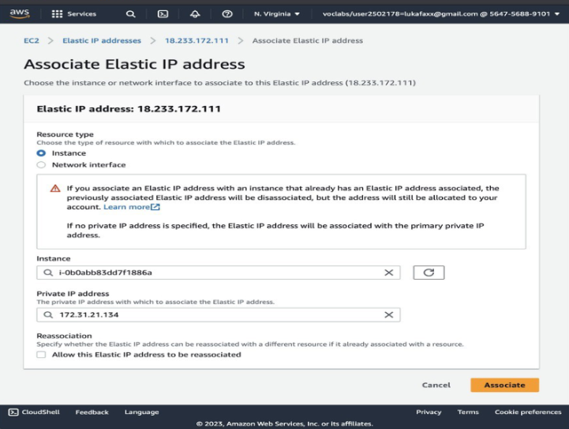

# AWS Service Setup Guide: Elastic IP

## 1. Overview
An Elastic IP (EIP) is a **static, public IPv4 address** that you own on your AWS account and can attach to any EC2 instance or NAT gateway. Normal EC2 public IPs change every time the instance is stopped/started; an EIP stays the same. During the internship an EIP was allocated and associated with a web-server EC2 instance so the public IP remained stable across reboots (important for DNS records and bookmarks).

## 2. Step-by-Step Setup Guide
1. Open the **EC2** console → **Network & Security → Elastic IPs**.
2. Click **Allocate Elastic IP address**. Network Border Group: your region (e.g., `ap-south-1`). Public IPv4 address pool: **Amazon's pool of IPv4 addresses**.
3. Click **Allocate**. A new public IP (e.g., `13.234.xx.xx`) is now reserved in the account.
4. Select the new EIP → **Actions → Associate Elastic IP address**.
5. Resource type: **Instance**. Choose the running EC2 instance. Private IP: leave default. Click **Associate**.
6. Stop and start the EC2 instance and confirm its **public IPv4** stays the same.
7. **Important:** to avoid hourly charges, when the lab is over, **disassociate** and **release** the EIP.

## 3. Key Configurations Used
* **EIP name tag:** `Vineet-WebServer-EIP`
* **Public IPv4 pool:** Amazon-owned
* **Associated resource:** EC2 instance `Vineet-WebServer`
* **Region:** `ap-south-1` (Mumbai)
* **Post-lab action:** Released to avoid idle charges

### Screenshots 
 