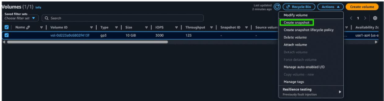

# AWS Service Setup Guide: EBS Volumes & Snapshots

## 1. Overview
EBS (Elastic Block Store) provides persistent block-level storage volumes that attach to EC2 instances like virtual hard drives. **Snapshots** are point-in-time backups of a volume stored in S3, from which new volumes can be created (in the same or a different AZ). During the internship an extra EBS volume was attached to an EC2 instance, formatted, mounted, and then snapshotted to practice backup and restore.

## 2. Step-by-Step Setup Guide
1. Open **EC2 → Elastic Block Store → Volumes → Create volume**.
2. Volume type: **gp3**. Size: **10 GiB**. AZ: **same AZ as the target EC2 instance** (this is mandatory).
3. Tag it `Vineet-Data-Vol`, then **Create volume**.
4. Select the new volume → **Actions → Attach volume** → choose the EC2 instance, device name `/dev/sdf`.
5. SSH into the EC2 instance and format + mount the volume:
   ```
   sudo lsblk                       # confirm /dev/xvdf (or nvme1n1) shows up
   sudo mkfs -t xfs /dev/xvdf
   sudo mkdir /data
   sudo mount /dev/xvdf /data
   df -h                            # verify /data is mounted
   ```
6. Write a test file: `echo "test" | sudo tee /data/hello.txt`.
7. Back in the console: **Volumes → select → Actions → Create snapshot**. Description: `Vineet-Data-Vol backup`.
8. Watch the snapshot in **EBS → Snapshots** until state is **completed**.
9. (Optional restore test) Snapshot → **Actions → Create volume from snapshot** → same AZ → attach to instance as `/dev/sdg` → mount → confirm `hello.txt` is present.

## 3. Key Configurations Used
* **Volume type:** gp3, 10 GiB, 3000 IOPS default
* **AZ:** same as EC2 (e.g., `ap-south-1a`)
* **Device name:** `/dev/sdf`
* **File system:** XFS, mounted at `/data`
* **Snapshot description:** `Vineet-Data-Vol backup`

## 4. Implementation Proof & Verification
> [!NOTE]
> Below are the visual confirmations of the successful setup and configuration.

### Screenshots to capture
